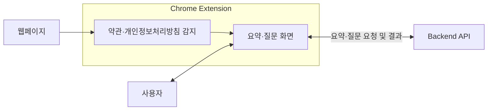
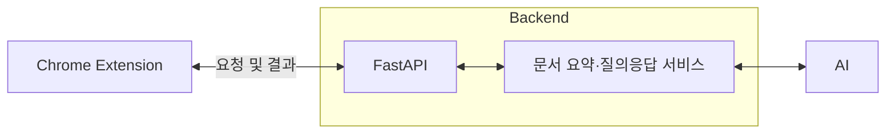

# Donguibogam (동의보감)

**이용약관/개인정보처리방침을 감지/요약하고, 질문할 수 있는 챗봇 서비스**

[서비스 바로가기](https://chromewebstore.google.com/detail/%EB%8F%99%EC%9D%98%EB%B3%B4%EA%B0%90-%EC%95%BD%EA%B4%80-%EC%9A%94%EC%95%BD-ai/jlanbanllnnifbjckaoldeaknhfjmhcj)

> 애플리케이션 소스 코드는 포함하지 않습니다.

## 프로젝트 소개

### 배경과 목표

서비스에 가입하거나 개인정보 제공에 동의할 때 마주하는 이용약관과 개인정보처리방침은 길고 어려워 핵심 조건을 파악하기 쉽지 않습니다. **동의보감(Donguibogam)**은 웹페이지에서 이러한 문서를 감지하고, AI 요약과 문서 기반 질의응답으로 사용자의 이해를 돕는 Chrome 확장 프로그램입니다.

목표는 사용자가 보고 있는 페이지에서 개인정보 수집·보관·제공 조건, 해지·환불 조건, 주의할 조항을 쉽게 확인하도록 하는 것입니다. 짧은 요약에서 시작해 궁금한 내용을 질문하며 세부 조건을 살펴보는 경험을 지향합니다.

### 핵심 시나리오

> "으악 너무 길어!"

1. 사용자가 이용약관 또는 개인정보처리방침이 있는 웹페이지를 방문합니다.
2. 확장 프로그램이 문서 영역을 감지하고 진입 버튼을 표시합니다.
3. 패널을 열어 핵심 내용과 주의사항을 요약으로 확인합니다.
4. 추천 질문을 선택하거나 직접 질문을 입력합니다. 예를 들어 “탈퇴 후에도 남는 정보가 있나요?”처럼 물어볼 수 있습니다.
5. 현재 문서에서 관련 내용을 찾아 생성한 답변을 읽고, 후속 질문으로 필요한 조건을 더 확인합니다.

### 개발 역할

프로젝트의 개발 영역과 역할은 다음과 같습니다.

- **Chrome Extension · Frontend:** 웹페이지 문서 감지와 본문 추출, 요약·채팅 UI 개발, 백엔드 API 연동
- **Backend:** FastAPI 기반 API 설계, 문서 및 대화 관리, AI 기능 연동
- **AI:** 문서 요약과 질문 추천, 문서 내용과 대화 문맥을 활용한 답변 생성

## 주요 기능

| 기능 | 설명 |
| --- | --- |
| 약관·개인정보처리방침 자동 감지 | 제목, 본문 구조, URL 등 여러 단서를 점수화해 문서 후보를 찾고, DOM 변화에 따라 다시 탐색합니다. |
| 핵심 요약과 주의사항 | 긴 문서를 쉬운 한국어로 요약하고, 사용자가 확인할 주요 조건과 주의사항을 함께 제시합니다. |
| 문서 기반 Q&A | 현재 문서에서 질문과 관련된 내용을 검색해 답변을 생성하는 RAG 방식을 사용합니다. |
| 추천 질문과 후속 대화 | 요약 및 답변과 연결되는 질문을 제안하고, 이전 대화 문맥을 반영해 대화를 이어갑니다. |
| 문서 버전별 요약 재사용 | 동일한 문서 버전의 요약을 재사용해 반복 분석을 줄입니다. |

## Architecture

### Frontend

Chrome 확장 프로그램에서 문서를 감지하고, 사용자가 요약을 확인하거나 질문을 입력할 수 있는 화면을 제공합니다.

### Backend

FastAPI 서버가 확장 프로그램의 요청을 받아 AI와 연동하고, 문서 요약·질의응답·추천 질문을 제공합니다.

## Tech Stack

| 영역 | 기술 | 사용 목적 |
| --- | --- | --- |
| Extension |  | Content Script, Service Worker, Side Panel, Storage API |
| Frontend |    | 확장 프로그램 UI와 빌드 |
| Backend |     | 비동기 API, 요청·응답 검증, 데이터 접근 |
| Data |    | 문서 저장, 세션·요청 제어, 벡터 검색 |
| AI |  | 요약·답변·추천 질문 생성, 질문 분류, 임베딩 |
| Packaging |  | 백엔드 컨테이너 패키징 |
